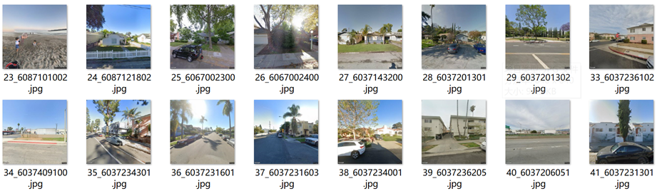

# Mobility AI with urban imagery

### Using CNN to Predict Median Property Value in California

### 1. Introduction

High-resolution satellite images covering a significant portion of the Earth's surface have been accessible for more than a decade. More recently, sophisticated deep learning techniques have been employed to leverage these images. In this project, we use transfer learning techniques, starting with a Convolutional Neural Network (CNN) model pretrained on the ImageNet dataset, and then fine-tuning the model using satellite images to predict median property value.

### 2. Timeline

###### Gather Information (week 1)

- Read the references papers
- Obtain the required data
- Find coding resources

###### Practice (week 2)

- Clean the data
- Apply code on the dataset

###### Review and Refine (week 3-4)

- Collect first-stage results
- Analyze the results
- Improve the model

###### Conclude (week 5)

- Collect all results
- Upload code to the GitHub repository

### 3. Methods

##### (1) Data Introduction

We downloaded the satellite images and street view images by using GoogleMapAPI. 

- Satellite Images (9129)

  

- Street View Images (6440)

  

- Census Tract (8012)

  

We first create and enable Google API key. Then we use geopanda to read the shapefile and extract geoid, latitude and longitude to form the coordinate file. With the API key and the coordinate file, we use GoogleMapAPI to download images. 

The name of the images: "No._FIPS" 

##### (2) Model Introduction

###### AlexNet

It is a model designed by Alex Krizhevsky, Ilya Sutskever and Geoffrey Hinton. The model won ILSVRC(ImageNet Large Scale Visual Recognition Challenge) in 2012.

The structure of the original Alexnet:

In this project, we use the Alexnet pretrained on ImageNet. Also, since we want the model to predict the specific value, we change the out features of the last layer of the model from 1000 to 1.

###### VGG16

VGG stands for Visual Geometry Group; it is a standard deep Convolutional Neural Network (CNN) architecture with multiple layers. 

It was one of the most popular models submitted to ILSVRC-2014. It replaces the large kernel-sized filters with several 3×3 kernel-sized filters one after the other, thereby making significant improvements over AlexNet. (https://viso.ai/deep-learning/vgg-very-deep-convolutional-networks/)

Structure of VGG16:

Same as AlexNet, we use the pretrained VGG16 model in this project and modify the out feature of the last layer of the model from 1000 to 1.

###### ResNet+attention

Inspired by the human visual system, the attention mechanism enables models to selectively focus on relevant regions or features within an image, improving their ability to analyse, interpret, and extract meaningful information.

##### (3) Evaluation

We use MSE and $R^2$ to evaluate the performance of the model. 

- MSE = mean squared error
- R² = coefficient of determination
- RSS = sum of squares of residuals
- TSS = total sum of squares

MSE means the average squared difference between the estimated values and the actual value. 

An R-Squared value shows how well the model predicts the outcome of the dependent variable. R-Squared values range from 0 to 1. An R-Squared value of 0 means that the model explains or predicts 0% of the relationship between the dependent and independent variables.

##### (4) Training

The hyperparameters we use when training are listed as follows:

- Dataset:
  - 70% training set, 30% test set
  - satellite images: 6390+2739
  - street view images: 4508+1932

- Loss function: MSE
- Optimizer: Adam
- Learning rate: 0.001
- Batch size: 128
- Epochs:
  - Satellite images, Alexnet: 50 epochs
  - Satellite images, VGG16: 80 epochs
  - Street view images, Alexnet: 50 epochs
  - Street view images, VGG16: 70 epochs

### 3. Results

##### (1) MSE and $R^2$ value

The model trained by satellite images can have the higher $R^2$ and lower MSE value than the model trained by street view images.

The VGG model can have the lower MSE value and slightly higher $R^2$ value than the Alexnet.

So based on the MSE and $R^2$ results, the VGG model trained by satellite images performs better than the other models.

##### (2) Scatter Plots

The scatter plots of ground truth median property value v.s. our predictions. The red line is y=x, which means the perfect predictor.

For the model trained by street view images, there are more dots fall in the red area, which means the model tends to predict lower value compared to the model trained by satellite images. The dots should be close to the red line.

Since there are 9129 FIPS in the shapefile but only 8012 data in the census tract file, for the FIPS not in the census tract file, we set the value into 0. The predictions are not equal to 0, so when the ground truth is 0, the dots form into a straight line.

##### (3) Visualization

This is Visualization of median property value in California, all the model can predict that places in San Francisco and Santa Clara and Los Angeles have higher median property value. Also, model trained by satellite images look more similar to the ground truth.

This is Visualization of median property value in Santa Clara county.

This is the census tracts around San Jose.

To conclude, predictions from model trained by satellite images are more closer to the ground truth.  

### 4. Conclusion and Discussion

(1) Model trained by satellite images performs better than model trained by street view images. We guess this is because  the street view images lack representativeness and information so one street view image per FIPS may be not enough.

(2) VGG16 is slightly better than AlexNet. It is reasonable because VGG16 has deeper layers than AlexNet so this model can better extract features. Also, VGG16 has smaller kernel sizes compared to AlexNet, which can reduce computational costs. 
